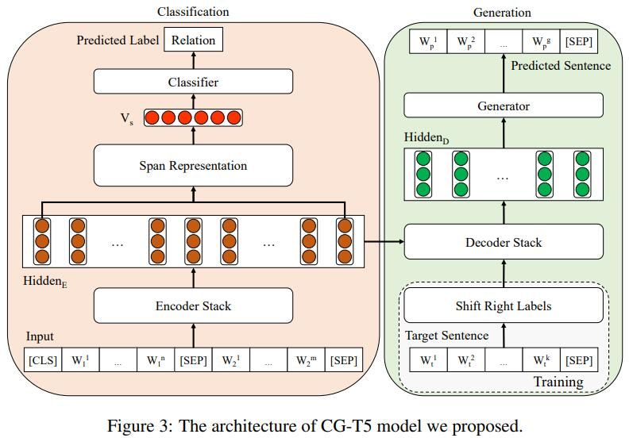

# Not Just Classification: Recognizing Implicit Discourse Relation on Joint Modeling of Classification and Generation
## 1. Preface
The repository contains the main code of the paper 《Not Just Classification: Recognizing Implicit Discourse Relation on Joint Modeling of Classification and Generation》, which is implemented by the pytorch framework.

Abstract of the paper：



Implicit discourse relation recognition (IDRR) is a critical task in discourse analysis. Previous studies only regard it as a classification task and lack an in-depth understanding of the semantics of different relations. Therefore, we first view IDRR as a generation task and further propose a method joint modeling of the classification and generation. Specifically, we propose a joint model, CG-T5, to recognize the relation label and generate the target sentence containing the meaning of relations simultaneously. Furthermore, we design three target sentence forms, including the question form, for the generation model to incorporate prior knowledge. To address the issue that large discourse units are hardly embedded into the target sentence, we also propose a target sentence construction mechanism that automatically extracts core sentences from those large discourse units. Experimental results both on Chinese MCDTB and English PDTB datasets show that our model CG-T5 achieves the best performance against several state-of-the-art systems.

The url of paper：https://aclanthology.org/2021.emnlp-main.187/

## 2. Details of implementation
## 2.1 Environment install
python3.6
```bash
conda create -n cg_t5 python=3.6
conda activate cg_t5
```
python requirements
```bash
pip install -r requirements.txt
```
## 2.2. Data preprocessing
The url of original PDTB 2.0：https://catalog.ldc.upenn.edu/LDC2008T05

The details of the dataset, please see the paper：https://aclanthology.org/2020.acl-main.480/

The details of the preprocessing, please follow the readme.md in **data_preprocess** folder.
## 2.2.  Training and testing

We used an NVIDIA Tesla v100-sxm2 32G GPU for experiments.

Although we have fixed the seed, we can get reproducible results on the same model of GPU.

However, there is still no guarantee that the same results can be obtained on different models of GPU.

After downloading the T5 model, place it in the **T5** folder：https://huggingface.co/t5-base

For convenience, you can run the command in run_train.sh for training and 
run the command in run_test.sh for testing.

## 2.3. Evaluation
you can run the command as following for evaluation:
```cmd
python3 evaluate.py
```
 
## 3. Reference and acknowledge
The reference format:
```bib
@inproceedings{jiang-etal-2021-just,
    title = "Not Just Classification: Recognizing Implicit Discourse Relation on Joint Modeling of Classification and Generation",
    author = "Jiang, Feng  and
      Fan, Yaxin  and
      Chu, Xiaomin  and
      Li, Peifeng  and
      Zhu, Qiaoming",
    booktitle = "Proceedings of the 2021 Conference on Empirical Methods in Natural Language Processing",
    month = nov,
    year = "2021",
    address = "Online and Punta Cana, Dominican Republic",
    publisher = "Association for Computational Linguistics",
    url = "https://aclanthology.org/2021.emnlp-main.187",
    pages = "2418--2431",
    abstract = "Implicit discourse relation recognition (IDRR) is a critical task in discourse analysis. Previous studies only regard it as a classification task and lack an in-depth understanding of the semantics of different relations. Therefore, we first view IDRR as a generation task and further propose a method joint modeling of the classification and generation. Specifically, we propose a joint model, CG-T5, to recognize the relation label and generate the target sentence containing the meaning of relations simultaneously. Furthermore, we design three target sentence forms, including the question form, for the generation model to incorporate prior knowledge. To address the issue that large discourse units are hardly embedded into the target sentence, we also propose a target sentence construction mechanism that automatically extracts core sentences from those large discourse units. Experimental results both on Chinese MCDTB and English PDTB datasets show that our model CG-T5 achieves the best performance against several state-of-the-art systems.",
}
```

Thanks for [gpt2-newstitle](https://github.com/liucongg/GPT2-NewsTitle)，
[t5-pegasus pytorch](https://github.com/renmada/t5-pegasus-pytorch)，
[span-rep](https://github.com/shtoshni/span-rep)，
we build our code based on the above project.